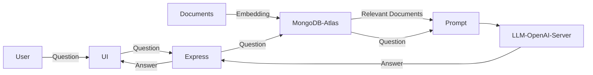

1. A description of the scenario your project is operating in

   Large Lanuage Models, although trained on large amounts of data, have limited domain-specific knowledge. This limitation makes them less effective for chatbots or similar apps that require domain specific data.

3. A description of what problem your project seeks to solve.

   Retrieval Augmented Generation (RAG) solves this concern by allowing LLMs access to external knowledge sources for a more accurate response generation. This means that with RAG, one can have an LLM that receives relevant information from specific knowledge base as context during the generation process to respond accurately to questions and inquiries from end users.

   
   
   https://machinelearningmastery.com/understanding-rag-part-ii-how-classic-rag-works/

5. A description of what the technical components of your project will be, including: the routes, the data models, any external data sources you'll use, etc.

   a. UI for Q&A (chatbot)
   
   b. Express server to handle the request
      1.  One route to upload the data
         
      3.  One route to respond to user question
         
   c. A vector database.  Mongodb Cloud

   d. Local LLM server 

7. Clear and direct call-outs of how you will meet the various project requirements.

   

9. A timeline for what project components you plan to complete, week by week, for the remainder of the class.

  Week 6: Simple UI , Sign up with Mongodb Cloud
  
  Week 7: Stand up express server
  
  Week 8: Conect everything
  
  Week 9: Test and complete 

## UPDATE (5-22-2025):

### Completed: 
- Registration with Mongodb Cloud and spining up Atlas db and indexing 
- UI with input and ouptut from LLM
- Express server:
   - endpoint for embedding documents and saving to Atlas db
   - endpoint for taking user's query, searching Atlas db, connecting to a LLM and generating response

### In-progress:
- Integration testing
- Functional test
- Unittest

